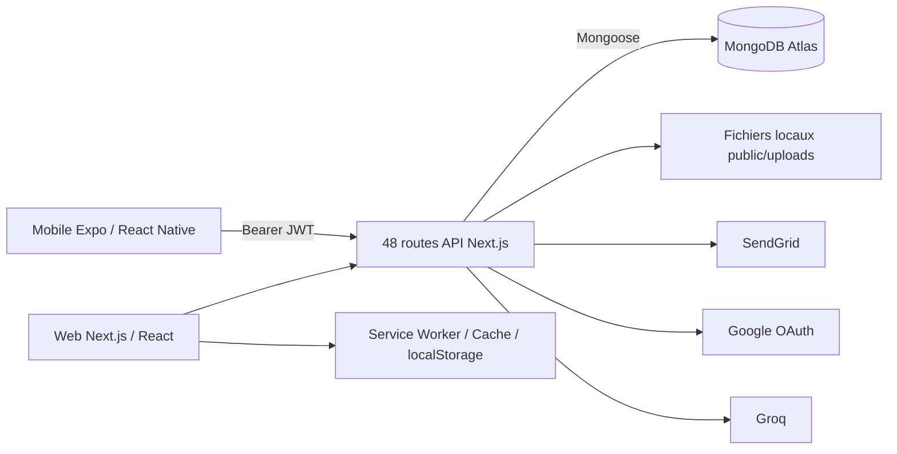

# Audit du projet MonDocteur / Santé Guinée

Date de l’audit : 7 septembre 2026  
Révision examinée : `281ff31`, avec l’état local du projet au moment de l’audit.  
Nature : audit du code, de la configuration locale et des dépendances, sans exploitation distante.

**Le projet présente plusieurs failles bloquantes pour une utilisation avec des données médicales réelles.** La plus urgente permet de créer un compte administrateur depuis l’inscription publique. D’autres défauts compromettent la confidentialité des documents, l’isolation des sessions et la fiabilité des rendez-vous.

Aucun fichier du projet n’a été modifié pendant l’audit. L’état Git final correspondait à l’état initial. Aucun appel à MongoDB, SendGrid, Google OAuth, Groq ou à l’application en production n’a été effectué. Le présent document a ensuite été créé à la demande de l’utilisateur ; aucune correction du projet n’a été appliquée.

## 1. Périmètre, architecture et vérifications réalisées

L’inventaire comprend 154 fichiers source web/mobile, soit environ 24 324 lignes, dont **48 fichiers de routes API**. La recherche de secrets a parcouru 199 fichiers texte locaux et 389 versions de fichiers texte dans les **70 commits accessibles par les références Git locales**.

L’architecture réelle est la suivante :



| Élément | Implémentation observée |
|---|---|
| Web et backend | Next.js 14.2.35, App Router, React 19.2.5 |
| Mobile | Expo 55.0.20, React Native 0.83.6, React 19.2.0 |
| Base réelle | MongoDB via Mongoose 9.5.0 |
| Authentification | JWT HS256 valables sept jours ; cookie web et Bearer mobile |
| Rôles | Patient, médecin, pharmacien, laboratoriste, administrateur |
| Données | Utilisateurs, professionnels, rendez-vous, conversations, messages, dossiers patients, avis, abonnements |
| Documents | Disque local sous `public/uploads` ; certaines métadonnées uniquement en mémoire |
| Abonnements | Demandes puis activation manuelle par un administrateur |
| Backend Express/tRPC/MySQL | Dépendances et documentation présentes, mais aucun serveur correspondant dans le code actuel |

### Résultats des contrôles

| Contrôle | Résultat |
|---|---|
| TypeScript web, sans émission ni cache incrémental | **Échec : 5 erreurs** |
| TypeScript mobile, mêmes restrictions | **Échec : 4 erreurs** |
| ESLint web et mobile | **Inexécutable normalement : configurations absentes** |
| Vitest mobile, cache désactivé | **Aucun fichier de test trouvé** |
| Tests web | Aucun script ni suite identifié |
| Vérifications locales ciblées | 10 contrôles avec mocks ou schémas locaux confirmant des défauts |
| Audit npm/pnpm | Réalisé sur les trois arbres de dépendances |
| Recherche de secrets | Analyse locale et historique, valeurs sensibles masquées |

Les confirmations locales concernent notamment l’inscription administrateur, la connexion suspendue, l’usurpation d’expéditeur, les champs sensibles du cabinet, la perte du téléphone, le genre patient invalide, la reconnexion MongoDB, la file hors ligne et la redirection incorrecte du profil.

**Limites :** cet audit porte sur le dépôt et les dépendances disponibles, pas sur l’état réel du déploiement. Les permissions Atlas, sauvegardes, volumes Render, reverse proxy, certificats et headers effectivement servis restent non vérifiés. Les images et autres binaires n’ont pas fait l’objet d’une recherche exhaustive de secrets par OCR. L’absence de résultat dans une recherche par motifs ne garantit pas l’absence de secret.

Les références de lignes ci-dessous correspondent aux fichiers examinés au moment de l’audit. Les liens sont relatifs à la racine du dépôt pour conserver la portabilité de ce document.

## 2. Vulnérabilités, classées par criticité

### S01 — Critique — Inscription publique comme administrateur

Fichier : [signup/route.ts](web/app/api/auth/signup/route.ts), lignes 22 et 60–68.

- **Description :** `role` provient directement du JSON client et est transmis à `User.create`. Le schéma accepte `admin`.
- **Risque :** accès administratif aux utilisateurs, rendez-vous et abonnements.
- **Scénario :** inscription avec le rôle administrateur, puis connexion. La connexion ne demande même pas que l’email soit vérifié.
- **Correction :** liste explicite des rôles autorisés à l’inscription ; création des administrateurs par une procédure distincte et protégée.
- **Validation :** confirmé en exécutant le gestionnaire avec des dépendances simulées.

Exemple de correction, **non appliqué** :

```ts
const publicRoles = ['patient', 'doctor', 'pharmacist', 'laboratorist'];

if (typeof role !== 'string' || !publicRoles.includes(role)) {
  return NextResponse.json({ error: 'Rôle invalide' }, { status: 400 });
}
```

L’autorisation d’exercer comme professionnel doit ensuite être indépendante du rôle demandé.

### S02 — Critique si la variable manque — Secret JWT public de secours

Fichier : [lib/auth.ts](web/lib/auth.ts), lignes 4–6.

- **Description :** une chaîne connue remplace automatiquement `JWT_SECRET` lorsqu’elle est absente.
- **Risque :** fabrication de JWT valides pour n’importe quel utilisateur et rôle.
- **Scénario :** déploiement ou instance de secours mal configuré.
- **Correction :** refuser le démarrage sans secret suffisamment robuste ; renouveler les secrets et sessions si cette configuration a été utilisée.
- **État local :** `JWT_SECRET` est renseigné. L’exploitation en production n’est donc pas affirmée.

```ts
const secret = process.env.JWT_SECRET;
if (!secret) throw new Error('JWT_SECRET requis');
const JWT_SECRET = new TextEncoder().encode(secret);
```

### S03 — Haute — Comptes suspendus ou non vérifiés autorisés à se connecter

Fichiers : [login/route.ts](web/app/api/auth/login/route.ts), ligne 31 ; [Google callback](web/app/api/auth/google/callback/route.ts), ligne 66.

- **Description :** aucun refus fondé sur `isSuspended` ; le login classique ignore aussi `isVerified`.
- **Risque :** suspension administrative et vérification email inefficaces.
- **Scénario :** un compte suspendu obtient un nouveau token avec son mot de passe.
- **Correction :** contrôler l’état du compte avant émission du token et lors de l’autorisation des requêtes.
- **Validation :** login d’un compte suspendu et non vérifié confirmé avec mocks.

### S04 — Haute — Sessions non révocables et rôles périmés

Fichiers : [lib/auth.ts](web/lib/auth.ts), ligne 16 ; [logout](web/app/api/auth/logout/route.ts), ligne 4 ; [change-password](web/app/api/auth/change-password/route.ts), ligne 35.

- **Description :** les API utilisent le rôle du JWT pendant sept jours, sans contrôler l’existence actuelle du compte ni une version de session.
- **Risque :** droits conservés après rétrogradation, suppression, changement de mot de passe ou déconnexion.
- **Scénario :** un ancien administrateur réutilise un token déjà émis.
- **Correction :** sessions révocables ou `tokenVersion`, validation du compte courant, expiration plus courte et rotation adaptée.

### S05 — Haute — Usurpation d’expéditeur et association arbitraire de rendez-vous

Fichiers : [conversations POST](web/app/api/conversations/route.ts), ligne 76 ; [lecture de conversation](web/app/api/conversations/[id]/route.ts), ligne 32.

- **Description :** `patientId`, `doctorId`, `appointmentId` et l’expéditeur initial sont acceptés sans vérifier leurs relations avec l’utilisateur connecté.
- **Risque :** faux messages attribués à un patient ; exposition de métadonnées d’un rendez-vous tiers.
- **Scénario :** créer une conversation dont on est le patient, mais liée à l’identifiant d’un autre rendez-vous ; sa lecture peuple ensuite date, heure, motif et statut de ce rendez-vous.
- **Correction :** dériver l’expéditeur de la session, charger le rendez-vous et vérifier ses participants avant toute création.
- **Validation :** confiance accordée aux identifiants arbitraires confirmée avec mocks ; aucune donnée réelle consultée.

### S06 — Haute — Documents médicaux placés dans un espace public

Fichiers : [documents](web/app/api/pro/documents/route.ts), ligne 7 ; [documents patients](web/app/api/pro/patients/upload/route.ts), ligne 42 ; [pièces jointes](web/app/api/conversations/[id]/upload/route.ts), ligne 60.

- **Description :** fichiers stockés dans `public/uploads`, puis distribués via une URL directe sans route de téléchargement autorisée.
- **Risque :** accès aux documents par une personne possédant leur URL, lorsque le déploiement sert ce répertoire.
- **Scénario :** URL transférée, récupérée dans un cache ou conservée après révocation d’accès.
- **Correction :** stockage privé, contrôle d’accès à chaque téléchargement, URLs signées courtes si nécessaire.
- **Limite :** la manière dont le déploiement sert les fichiers ajoutés après démarrage n’a pas été testée.

### S07 — Haute — Upload de contenu actif et XSS stockée

Fichiers : [documents POST](web/app/api/pro/documents/route.ts), ligne 42 ; [upload-photo](web/app/api/pro/upload-photo/route.ts), ligne 22 ; et uploads patients/conversations précités.

- **Description :** les documents généraux n’ont aucune liste de types autorisés. Les autres routes font confiance au MIME fourni par le client et conservent une extension issue du nom.
- **Risque :** publication de HTML/SVG actif sur l’origine de l’application.
- **Scénario :** dépôt de contenu HTML, éventuellement annoncé comme une image, puis ouverture de son URL par une victime.
- **Correction :** détecter le format réel, imposer les extensions, réencoder les images, isoler les téléchargements sur une origine distincte et servir les documents en pièce jointe.
- **Portée :** XSS conditionnée au service effectif de ces fichiers ; aucune exécution serveur de fichier uploadé n’a été démontrée.

### S08 — Haute — Cache hors ligne partagé entre utilisateurs

Fichier : [sw.js](web/public/sw.js), lignes 52–83 et 100–129.

- **Description :** les réponses API authentifiées et les uploads sont mis en cache sans séparation par utilisateur. La déconnexion ne purge pas ce cache.
- **Risque :** exposition de dossiers, conversations et informations administratives sur un appareil partagé.
- **Scénario :** A consulte ses données, se déconnecte ; B utilise ensuite le même navigateur hors ligne.
- **Correction :** exclure les données sensibles du cache générique ; purge au changement de session ; conception explicite si un mode médical hors ligne est indispensable.

### S09 — Haute — Mots de passe et requêtes sensibles stockés dans la file hors ligne

Fichiers : [sw.js](web/public/sw.js), ligne 85 ; [PWAProvider](web/components/PWAProvider.tsx), ligne 110.

- **Description :** tous les POST en échec réseau sont sérialisés, headers et corps compris, puis stockés dans `localStorage`.
- **Risque :** conservation en clair des mots de passe, tokens éventuels et informations médicales ; rejeu sous une autre session.
- **Scénario :** connexion hors ligne enregistrée localement ; rendez-vous de A envoyé après connexion de B.
- **Correction :** exclure totalement l’authentification ; limiter la file à des opérations précises, liées à une identité et munies d’une clé d’idempotence.
- **Validation :** mise en file du corps d’un login et retour HTTP 202 confirmés localement.

### S10 — Haute — Autorisations professionnelles appliquées surtout dans l’interface

Fichiers : [pro/access](web/app/api/pro/access/route.ts), ligne 41 ; [AI chat](web/app/api/ai/chat/route.ts), ligne 27 ; [documents](web/app/api/pro/documents/route.ts), ligne 35 ; [cabinet](web/app/api/pro/cabinet/route.ts), ligne 19.

- **Description :** le contrôle d’abonnement de `/pro/access` n’est pas réutilisé par les API métier. Certaines exigent seulement une authentification.
- **Risque :** fonctions payantes accessibles sans abonnement ; fonctionnalités professionnelles utilisées sans validation de qualification.
- **Scénario :** inscription comme médecin puis appel direct de l’IA ; patient appelant les documents ou le cabinet.
- **Correction :** garde serveur commune contrôlant rôle, suspension, validation professionnelle, abonnement et permission propre à l’opération.

### S11 — Haute — Modification de champs administratifs du cabinet

Fichier : [cabinet PUT](web/app/api/pro/cabinet/route.ts), ligne 63.

- **Description :** `{ $set: body }` accepte notamment `userId`, `isVerified`, `rating`, `reviewCount` et `isActive`.
- **Risque :** falsification de vérification et de réputation, transfert de propriété du profil.
- **Scénario :** propriétaire d’un cabinet modifiant directement les champs qui devraient être administratifs.
- **Correction :** liste blanche de champs éditables, propriétaire immuable, `runValidators: true`.
- **Validation :** ces champs survivent au casting Mongoose local.

### S12 — Haute — Dépendance Next.js vulnérable ; SSRF potentielle au niveau serveur

Fichiers : [package web](web/package.json), ligne 18 ; [lockfile](web/pnpm-lock.yaml), ligne 26.

- **Description :** Next.js 14.2.35 figure dans plusieurs plages vulnérables.
- **Risque :** notamment déni de service et SSRF selon les fonctionnalités et le déploiement.
- **Scénario pertinent :** le serveur Node intégré, utilisé par `next start`, reçoit des requêtes WebSocket Upgrade malveillantes. L’avis officiel décrit l’accès possible à des destinations internes.
- **Correction :** migration vers une branche maintenue corrigée ; contrôle des upgrades et des sorties réseau en mitigation temporaire.
- **Limite :** transit des upgrades et exposition de l’origine Render non vérifiés.

Source : [avis officiel SSRF](https://github.com/vercel/next.js/security/advisories/GHSA-c4j6-fc7j-m34r).

### S13 — Haute — Aucune limitation applicative des tentatives et des volumes

Zones : login, signup, verify-otp, resend-otp, subscribe, delete-request, uploads et IA.

- **Description :** absence de quotas ou limitation de fréquence dans le code examiné.
- **Risque :** attaques par mots de passe, essais OTP, spam email, saturation CPU/disque et consommation du service IA.
- **Scénario :** appels répétés au hachage bcrypt, renvois OTP ou uploads successifs.
- **Correction :** limites distribuées par compte/IP, quotas de stockage, taille maximale des corps avant décodage, compteurs de tentatives.
- **Complément :** les OTP utilisent `Math.random()` ; employer `crypto.randomInt()` et une consommation atomique du code.

### S14 — Haute si exécuté sur des données réelles — Seed destructif et identifiants partagés

Fichier : [seed.ts](web/scripts/seed.ts), lignes 60–84.

- **Description :** chargement automatique de `.env.local`, suppression complète de trois collections, création d’un compte avec un mot de passe fixe également journalisé.
- **Risque :** perte de données et accès à des comptes de démonstration.
- **Scénario :** exécution du seed dans un environnement dont l’URI vise une base réelle.
- **Correction :** base de test explicitement autorisée, refus en production, seed idempotent et identifiants aléatoires.
- **État :** script non exécuté ; présence du compte en production inconnue.

### S15 — Moyenne — OAuth sans protection `state`

Fichiers : [départ OAuth](web/app/api/auth/google/route.ts), ligne 12 ; [callback](web/app/api/auth/google/callback/route.ts), ligne 16.

- **Description :** aucun `state` lié au navigateur ; rattachement des comptes par email sans identité fournisseur persistée ni contrôle explicite `verified_email`.
- **Risque :** CSRF de connexion et rattachement de comptes insuffisamment robuste.
- **Scénario :** une victime ouvre un callback provenant d’un flux initié pour un autre compte.
- **Correction :** bibliothèque OAuth/OIDC éprouvée, `state`, PKCE, validation de l’email et liaison par identité fournisseur.
- **État local :** identifiants Google non renseignés ; activation en production inconnue.

### S16 — Moyenne — Annuaire de patients trop largement accessible

Fichier : [conversations/new](web/app/api/conversations/new/route.ts), ligne 70.

- **Description :** un utilisateur de rôle professionnel peut obtenir les noms et identifiants de jusqu’à 100 patients sans relation de soins.
- **Risque :** divulgation de l’inscription à la plateforme et contacts indésirables.
- **Scénario :** compte professionnel auto-déclaré consultant l’annuaire.
- **Correction :** limiter aux patients liés au professionnel ou à une recherche/invitation explicitement autorisée.

Le POST de cette route accepte aussi le nom, le rôle et le profil du destinataire fournis par le client, lignes 147–208. Ces informations doivent être résolues côté serveur.

### S17 — Moyenne — Entrées insuffisamment validées et expressions régulières contrôlées par le client

Fichiers : [doctors GET](web/app/api/doctors/route.ts), ligne 19 ; [laboratories GET](web/app/api/laboratories/route.ts), ligne 18 ; routes administratives et patients.

- **Description :** recherches injectées directement dans `$regex`, pagination non finie/non positive acceptée, types JSON rarement validés.
- **Risque :** requêtes coûteuses, erreurs 500 et consommation non bornée.
- **Scénario :** recherche regex coûteuse ou `limit=0`, qui supprime la limite MongoDB.
- **Correction :** schémas d’entrée, bornes strictes, échappement des recherches littérales, limites d’exécution MongoDB et index adaptés.

Aucun contournement du login par injection NoSQL n’a été démontré. Aucun accès SQL applicatif actif n’a été identifié.

### S18 — Moyenne — Pollution de prototype Mongoose accessible par une mise à jour libre

Fichiers : [cabinet PUT](web/app/api/pro/cabinet/route.ts), ligne 65 ; [version Mongoose](web/package.json), ligne 17.

- **Description :** Mongoose 9.5.0 est concerné par une pollution de prototype lors du casting d’updates contenant certains chemins contrôlés par l’utilisateur.
- **Risque :** perturbation de l’état du processus ; cette route transmet précisément des clés non filtrées à `$set`.
- **Scénario :** requête authentifiée contenant un chemin de mise à jour malveillant.
- **Correction :** Mongoose ≥ 9.7.2 et suppression des updates libres.
- **Statut :** chemin d’entrée identifié ; pollution non exécutée.

Source : [avis du mainteneur](https://github.com/Automattic/mongoose/security/advisories/GHSA-664h-wqgq-64gw).

### S19 — Moyenne — Injection HTML dans les emails

Fichiers : [templates email](web/lib/email.ts), ligne 61 ; [subscribe](web/app/api/pro/subscribe/route.ts), ligne 33 ; [suppression de compte](web/app/api/account/delete-request/route.ts), ligne 26 ; [mailer](web/lib/mailer.ts), ligne 58.

- **Description :** noms, messages et motifs sont interpolés sans échappement dans du HTML.
- **Risque :** falsification du contenu des emails et liens de phishing sous l’identité de la plateforme.
- **Scénario :** demande publique contenant des balises ou liens trompeurs reçue par l’administrateur.
- **Correction :** templates échappant les variables ; limiter les informations médicales dans les notifications.
- **Précision :** il s’agit d’injection HTML ; l’exécution JavaScript dans le client mail n’est pas présumée.

### S20 — Moyenne — Flux de données médicales vers l’IA insuffisamment encadré

Fichiers : [AI chat](web/app/api/ai/chat/route.ts), ligne 32 ; [privacy](web/app/privacy/page.tsx), ligne 94.

- **Description :** textes et images sont envoyés à Groq sans filtrage des identifiants patients. La politique cite MongoDB et SendGrid, mais pas Groq.
- **Risque :** transmission de données identifiantes sans information produit cohérente.
- **Scénario :** professionnel envoyant une ordonnance nominative.
- **Correction :** expliciter ce traitement, vérifier les conditions du prestataire, minimiser/anonymiser les données et encadrer les usages.
- **Autre défaut :** les rôles et contenus de `messages` ne sont pas validés ; imposer les rôles autorisés et des limites. Ce constat n’est pas une conclusion juridique.

### S21 — Moyenne — Protections navigateur et journalisation à renforcer

Fichiers : [next.config.js](web/next.config.js), ligne 2 ; [mailer](web/lib/mailer.ts), ligne 16.

- **Description :** aucune configuration applicative explicite de CSP, anti-framing, HSTS ou Permissions-Policy ; nombreuses erreurs brutes journalisées.
- **Risque :** impact accru d’une injection, clickjacking et présence possible de données personnelles dans les logs.
- **Scénario :** erreur de validation MongoDB ou fournisseur contenant une valeur utilisateur ; adresse email journalisée quand SendGrid manque.
- **Correction :** headers adaptés, logs structurés avec masquage, identifiant de corrélation et conservation limitée.
- **Limite :** le reverse proxy peut ajouter des headers ; leur absence en production n’est pas démontrée.

### Couverture des autres catégories demandées

| Catégorie | Conclusion |
|---|---|
| CSRF classique | Cookie `SameSite=Lax` utile, mais pas de contrôle Origin/jeton explicite. Le GET de lecture de messages modifie aussi `readBy`. Le défaut OAuth est établi séparément. |
| CORS | Aucun wildcard permissif identifié. L’absence de configuration empêche potentiellement le client Expo web sur une autre origine ; le natif n’est pas soumis au CORS navigateur. |
| Path traversal applicatif | Aucun chemin d’exploitation indépendant confirmé dans les uploads. Les noms doivent néanmoins être remplacés par des identifiants générés côté serveur. |
| SSRF métier | Destinations `fetch` principales fixes. L’URL image est transmise à Groq ; cela ne prouve pas une SSRF depuis le serveur applicatif. |
| XSS dans les composants | Pas de `dangerouslySetInnerHTML` identifié ; risques principaux dans les fichiers publics actifs et les emails. |
| Secrets Git | Pas de clé fournisseur reconnue dans l’historique analysé ; secret JWT de secours et mot de passe du seed présents dans le code. |

## 3. Bugs fonctionnels et scénarios de panne

Les problèmes de sécurité précédents sont également des bugs ; la liste suivante ajoute les défauts fonctionnels.

| ID / Sévérité | Fichier et zone | Description, risque et scénario | Correction recommandée |
|---|---|---|---|
| **B01 — Haute** | [messages web](web/app/messages/page.tsx), ligne 120 ; [messages pro](web/app/pro/messages/page.tsx), ligne 114 | L’effet dépend de `convs`, appelle `openConversation`, qui recrée `convs`. Avec `?conv=…`, cela réenclenche les lectures et écritures `readBy` en boucle. Risque de surcharge permanente. | Déclencher le chargement sur l’identifiant sélectionné ; rendre indépendante la mise à jour des badges. |
| **B02 — Haute** | [middleware](web/middleware.ts), ligne 44 | `'/profile'.startsWith('/pro')` vaut vrai. Un patient connecté est redirigé vers l’accueil lorsqu’il ouvre son profil. Confirmé localement. | Comparaison par segment, pas par préfixe brut. |
| **B03 — Haute** | [appointments POST](web/app/api/appointments/route.ts), ligne 51 ; [schéma](web/models/Appointment.ts), ligne 33 | Vérification du conflit puis insertion séparée, sans contrainte d’unicité du créneau actif. Deux requêtes simultanées peuvent réserver la même place. | Réservation atomique et contrainte unique adaptée aux statuts actifs ; gérer les conflits. |
| **B04 — Haute** | [appointments POST](web/app/api/appointments/route.ts), ligne 39 ; [créneaux web](web/app/doctors/[id]/page.tsx), ligne 37 | Aucun contrôle de l’existence/disponibilité du médecin, du passé, des horaires ou des créneaux réels. Horaires proposés fixes. | Endpoint de disponibilités et validation serveur du créneau normalisé. |
| **B05 — Haute** | [PWAProvider](web/components/PWAProvider.tsx), ligne 147 | La file complète en mémoire est réajoutée au stockage à chaque changement. Trois événements produisent six entrées dans la logique reproduite. Plusieurs onglets peuvent aussi rejouer les mêmes demandes. | Stockage transactionnel unique, déduplication, verrou de synchronisation et idempotence serveur. |
| **B06 — Haute** | [documents API](web/app/api/pro/documents/route.ts), ligne 9 | Métadonnées dans une `Map` de processus : perdues au redémarrage et différentes entre instances. Fichiers orphelins ; téléchargements ou suppressions introuvables. | Métadonnées en base et stockage durable commun. |
| **B07 — Haute** | [lib/db.ts](web/lib/db.ts), ligne 22 | La promesse de connexion rejetée reste en cache. Une première panne MongoDB empêche les nouvelles tentatives du processus. Confirmé avec mock. | Réinitialiser `cached.promise` après échec ; reconnexion contrôlée. |
| **B08 — Haute** | [forgot-password web](web/app/auth/forgot-password/page.tsx), ligne 36 ; [mobile](mobile/app/(auth)/forgot-password.tsx), ligne 24 | Le web simule envoi, validation et changement par des temporisations ; le mobile appelle trois endpoints inexistants. Le mot de passe n’est jamais réinitialisé. | Implémenter le parcours complet avec token de réinitialisation dédié, expirant et à usage unique. |
| **B09 — Moyenne** | [verify-otp web](web/app/auth/verify-otp/page.tsx), ligne 47 | Cette page simule la vérification et utilise un email fixe. Elle ne valide pas le compte. | Supprimer ce parcours doublon ou le connecter au véritable endpoint. |
| **B10 — Moyenne** | [User.ts](web/models/User.ts), ligne 23 ; [profile PUT](web/app/api/auth/profile/route.ts), ligne 22 | `phone` absent du schéma User et de plusieurs types. Les mises à jour sont ignorées ; le téléphone ne persiste pas. Confirmé localement. | Ajouter champ, validation et contrat partagé ; migrer si nécessaire. |
| **B11 — Moyenne** | [pro/dashboard](web/app/api/pro/dashboard/route.ts), ligne 11 ; [cabinet](web/app/api/pro/cabinet/route.ts), ligne 6 | `getAuthUser()` est appelé sans requête. Le Bearer mobile n’est pas lu. | Passer `req` à toutes les gardes d’authentification. |
| **B12 — Moyenne** | [profil mobile](mobile/app/pro/profile.tsx), ligne 35 ; [cabinet mobile](mobile/app/pro/cabinet.tsx), ligne 40 ; [dashboard mobile](mobile/app/pro/dashboard.tsx), ligne 119 | Contrats différents : `{doctor}` lu comme `{profile}`, `{profile}` comme `{cabinet}`, rendez-vous attendus à la racine au lieu de `stats`. `stats` absent pour pharmacie/laboratoire peut provoquer un crash après correction du Bearer. | Types de réponse partagés et adaptation explicite par rôle. |
| **B13 — Moyenne** | [patients mobile](mobile/app/pro/patients.tsx), ligne 36 ; [patients API](web/app/api/pro/patients/route.ts), ligne 8 | Genre `M` incompatible avec `homme/femme/autre` ; liste attendue plate alors que l’API renvoie `patient` imbriqué et `manual` séparé. POST autorisé aux trois rôles, GET au médecin seul. | Harmoniser enums, structure de liste et droits de lecture/écriture. |
| **B14 — Moyenne** | [favoris API](web/app/api/favorites/route.ts), ligne 42 ; [laboratoire web](web/app/laboratories/[id]/page.tsx), ligne 113 | Le frontend envoie `laboratory`, refusé par l’API. L’interface change malgré l’échec. | Implémenter les favoris laboratoires et traiter les réponses non réussies. |
| **B15 — Moyenne** | [avis médecin web](web/app/doctors/[id]/page.tsx), ligne 363 ; [reviews API](web/app/api/reviews/route.ts), ligne 16 | L’interface attend `patientName/date`, l’API renvoie `patientId/createdAt`. Noms absents et dates invalides. | DTO identique pour lecture et création des avis. |
| **B16 — Moyenne** | [admin gestion-pro](web/app/api/admin/gestion-pro/route.ts), ligne 36 | Limitation avant pagination globale ; avec un type sélectionné seuls 20 éléments sont chargés, puis repaginés. Les pages suivantes deviennent inaccessibles. | `countDocuments`, `skip`, `limit` cohérents ou agrégation commune. |
| **B17 — Moyenne** | [suppression User](web/app/api/admin/users/[id]/route.ts), ligne 36 ; [pro reviews](web/app/api/pro/reviews/route.ts), ligne 30 | Suppressions sans gestion des références. `patientId` peuplé peut devenir `null`, puis être déréférencé. | Politique d’archivage/anonymisation, traitement des références et tolérance aux valeurs absentes. |
| **B18 — Moyenne** | [appointments POST](web/app/api/appointments/route.ts), ligne 73 ; [messages POST](web/app/api/conversations/[id]/route.ts), ligne 89 | Création de conversation et emails lancés sans attente durable, erreurs avalées. Rendez-vous réussi mais conversation/notification manquante. | Transaction pour les écritures liées ; outbox/worker pour les notifications. |
| **B19 — Moyenne** | [mailer](web/lib/mailer.ts), ligne 15 ; [delete-request](web/app/api/account/delete-request/route.ts), ligne 13 | Absence de SendGrid pouvant être traitée comme succès ; suppression de compte confirmée même si l’email échoue. Aucun dossier durable de demande. | Persister la demande, distinguer enregistré/envoyé/échoué, réessayer les envois. |
| **B20 — Moyenne** | [activation abonnement](web/app/api/admin/subscription-requests/route.ts), ligne 84 | Demande marquée active avant recherche et mise à jour du profil. En cas d’échec, le statut reste actif ; un nouvel essai peut ne rien faire car `statusChanged=false`. | Transaction, association par `userId` et activation idempotente avec résultat vérifié. |
| **B21 — Moyenne** | [recherche médecins](web/app/doctors/page.tsx), ligne 39 ; [recherche avancée](web/app/doctors/search/page.tsx), ligne 29 | La liste ne lit pas les paramètres URL envoyés par les formulaires et liens. Plusieurs filtres avancés ne sont pas implémentés par l’API. | Contrat unique de filtres, lecture des paramètres et retrait des options non prises en charge. |
| **B22 — Moyenne** | [mobile doctors](mobile/app/(tabs)/doctors.tsx), ligne 33 ; listes pharmacies/laboratoires | Seule la première page API est chargée, sans pagination mobile. Résultats manquants au-delà de 12. Le filtre `Généraliste` ne correspond pas à `Médecin généraliste`. | Pagination/infinite scroll et identifiants de spécialités normalisés. |
| **B23 — Moyenne** | [documents mobile](mobile/app/pro/documents.tsx), ligne 63 | Upload sans vérifier `res.ok`, taille texte traitée comme nombre et URL relative ouverte directement. Faux succès et ouverture impossible sur mobile. | Vérifier le statut, renvoyer une taille numérique et résoudre l’URL avec l’origine API. |
| **B24 — Moyenne** | [unread API](web/app/api/conversations/unread/route.ts), ligne 17 | Conversations documentaires ignorées ; pharmacien recherché comme Doctor ; laboratoriste mal traité. | Même définition des conversations autorisées pour les listes et compteurs. |
| **B25 — Moyenne** | [AuthContext mobile](mobile/contexts/AuthContext.tsx), ligne 29 | Restauration sans `try/finally` et sans vérification serveur. Stockage corrompu : écran de chargement bloqué. Token expiré : interface encore connectée. | Gestion des erreurs, validation de session, traitement global des 401. |
| **B26 — Moyenne** | [messages web](web/app/messages/page.tsx), ligne 142 ; [admin demandes](web/app/admin/demandes-pro/page.tsx), ligne 57 | Plusieurs opérations sans `try/finally` ou contrôle HTTP. Une panne laisse `sending/saving/uploading` actif ou masque un échec. | Gestion uniforme des états de requête, messages récupérables et restauration du texte saisi. |
| **B27 — Moyenne** | [horaires laboratoire](web/app/laboratories/[id]/page.tsx), ligne 28 ; équivalent pharmacie | Heure locale du navigateur utilisée pour un établissement guinéen ; horaires passant minuit mal évalués. | Fuseau `Africa/Conakry`, jours d’ouverture et intervalles traversant minuit. |
| **B28 — Faible** | [dashboard API](web/app/api/pro/dashboard/route.ts), ligne 44 ; [patients API](web/app/api/pro/patients/route.ts), ligne 29 | Statistique mensuelle sans borne supérieure ; `$last` sans tri préalable pour motif/statut. | Bornes du mois et tri déterministe avant agrégation. |

Correction minimale de **B02**, non appliquée :

```ts
const isProRoute =
  pathname === '/pro' || pathname.startsWith('/pro/');
```

Le middleware décode par ailleurs le JWT sans vérifier sa signature ni son expiration. Ce contrôle doit être corrigé, mais il ne remplace jamais les autorisations serveur des API.

## 4. Architecture, production et dette technique

| Sévérité | Zone | Problème et conséquence | Recommandation |
|---|---|---|---|
| **Haute** | [next.config.js](web/next.config.js), ligne 8 | Erreurs TypeScript et ESLint ignorées au build ; une livraison peut réussir malgré des erreurs établies. | Rendre les contrôles bloquants après correction. |
| **Moyenne** | [package web](web/package.json), ligne 18 | Next 14 attend React 18.2 dans ses peer dependencies ; React 19 est installé, avec des types React 18. | Migrer vers un ensemble Next/React/types officiellement compatible. |
| **Moyenne** | [package mobile](mobile/package.json), ligne 7 | `dev:server`, `build`, `start`, `qr` visent des fichiers absents. | Retirer le serveur fantôme et corriger les commandes documentées. |
| **Moyenne** | Modèles `Doctor/Pharmacy/Laboratory/BusinessProfile` | Profil public et cabinet séparés sans synchronisation claire. Une modification du cabinet ne modifie pas nécessairement la fiche publique. | Définir une source de vérité et des mises à jour métier explicites. |
| **Moyenne** | Contrats web/mobile | Types recopiés et nombreux `any` masquant les incompatibilités détaillées ci-dessus. | Schémas partagés et contrats API vérifiables automatiquement. |
| **Moyenne** | [lib/email.ts](web/lib/email.ts), ligne 11 ; [lib/mailer.ts](web/lib/mailer.ts), ligne 3 | Deux clients SendGrid aux conventions d’erreur différentes. | Un service email unique avec résultat explicite et retries. |
| **Moyenne** | Environnements locaux | `.env.local` vise une base distante et l’URL web de production. Un build peut exécuter le fetch de statistiques de la page d’accueil. | Environnement d’audit/test isolé ; aucun build avec ces valeurs. |
| **Moyenne** | Déploiement | Pas de définition versionnée permettant de vérifier volume persistant, sauvegarde, limites réseau ou restauration. | Documenter et versionner la configuration non secrète ; tester la restauration sur une base isolée. |
| **Faible** | `.env.local.example` | Exemple ignoré et non suivi ; il ne décrit que trois variables alors que d’autres services sont requis. | Suivre un exemple complet sans secret et valider les variables au démarrage. |
| **Faible** | Documentation | Express/MySQL/Drizzle/Expo 54 décrits alors que le code réel diffère ; certains chemins et prérequis sont obsolètes. | Réécrire les guides à partir de l’architecture actuelle. |
| **Moyenne** | [accueil](web/app/page.tsx), ligne 10 | Professionnels, notes et avis codés en dur ; nombre total de médecins présenté comme nombre de médecins certifiés. | Données réelles, libellés exacts ou démonstration explicitement indiquée. |

Autres incohérences : la création de cabinet reçoit `analyses` du frontend mais ne le reprend pas dans son POST ; les avis peuvent être créés sans consultation préalable alors que la vue pro les marque systématiquement vérifiés ; aucune vérification serveur du droit au badge par offre n’est appliquée.

### Secrets et configuration

- `web/.env.local` et `mobile/.env` sont ignorés et non suivis par Git.
- Une clé Groq a été reconnue dans le fichier local ; sa valeur n’a pas été affichée.
- Le fichier local web contient une URI MongoDB distante et un secret JWT renseigné.
- SendGrid et Google OAuth sont vides localement.
- Les fichiers d’environnement sont en mode `0644` ; leur accessibilité réelle dépend aussi des répertoires parents.
- L’URI trouvée dans le guide Git utilise des identifiants d’exemple.
- Aucune recherche de validité des clés n’a été effectuée.
- Le parcours de suppression de compte ne vérifie pas l’identité du demandeur : aucune suppression manuelle ne devrait être exécutée sur la seule foi de cet email.

## 5. Dépendances vulnérables et mises à jour

Résultats bruts des audits :

| Arbre | Critiques | Hautes | Moyennes | Faibles |
|---|---:|---:|---:|---:|
| Web, pnpm | 0 | 30 | 21 | 3 |
| Mobile, pnpm | 2 | 43 | 36 | 5 |
| Racine, npm | 0 | 7 | 0 | 0 |

**Ces chiffres ne représentent pas autant de failles exploitables de l’application.** Ils incluent des dépendances transitives et des outils de développement ; les comptages npm et pnpm ne doivent pas être additionnés comme un total unique.

| Dépendance / zone | Version observée | Action recommandée |
|---|---|---|
| **Next.js — Haute** | 14.2.35 | Migrer vers une branche maintenue ; publication d’août : 15.5.24 ou 16.3.3, puis revérifier les avis au moment de la migration. |
| **Mongoose — Moyenne** | 9.5.0 | ≥ 9.7.2 ; corriger aussi l’update libre du cabinet. |
| **Axios mobile — Haute selon usage** | 1.15.0 | ≥ 1.18.0 d’après les alertes reçues ; tester l’adaptateur natif. Plusieurs alertes concernent spécifiquement Node/proxy. |
| **Vitest — Critique dans les conditions de l’avis** | 2.1.9 | ≥ 3.2.6 selon l’audit, ou version maintenue compatible. Aucun serveur UI Vitest exposé par le projet n’a été identifié. |
| **shell-quote — Critique dans les conditions de l’avis** | 1.8.3 | ≥ 1.9.0 via la chaîne d’outillage. Aucun appel métier direct identifié. |
| **Nodemailer — Haute selon usage** | 8.0.7 | Supprimer : non utilisé par les mailers actuels. S’il doit rester, version corrigée ≥ 9.0.1. |
| **tRPC server — Haute selon usage** | 11.7.2 | Supprimer si le backend abandonné n’est pas prévu ; sinon ≥ 11.8.0. |
| **Drizzle ORM — Haute selon usage** | 0.44.7 | Supprimer si inutilisé ; sinon ≥ 0.45.2. Aucune injection SQL métier démontrée. |
| **mysql2 — Moyenne selon usage** | 3.22.0 | Supprimer si inutilisé ; sinon ≥ 3.23.1. |
| **Puppeteer / transitives — Haute** | Branche 24 du lock racine | L’audit propose 25.10.0 ; vérifier la migration majeure. |
| **PostCSS — Haute selon traitement** | 8.4.31 / 8.4.49 / 8.5.x | ≥ 8.5.23 selon les alertes, y compris les copies transitives. |
| **ws — Haute** | 7.5.10 / 8.20.0 | 7.5.11 / ≥ 8.21.0 via les parents. |
| **js-yaml — Haute** | 3.14.2 / 4.1.1 | ≥ 3.15.1 / ≥ 4.3.1 selon branche. |
| **brace-expansion — Haute** | 1.1.14 / 2.1.0 / 5.0.5 | ≥ 1.1.18 / 2.1.4 / 5.0.9 selon branche. |
| **Autres transitives** | glob, Vite, esbuild, nanoid, xmldom, qs, browserslist, form-data, image-size… | Actualiser les paquets parents ; ne pas forcer des overrides incompatibles. `image-size` est signalé sans correctif proposé pour les avis reçus. |

Les versions d’août corrigent également des problèmes critiques conditionnels, mais ils ne sont pas attribués automatiquement à ce projet : l’optimisation d’images est désactivée et aucun déploiement Windows mixant les deux routeurs n’a été établi. Source : [publication Next.js d’août](https://nextjs.org/blog/august-2026-security-release).

Les deux alertes critiques mobiles concernent l’outillage et ses conditions d’utilisation, pas une exécution distante prouvée sur le téléphone. Sources : [avis Vitest](https://github.com/vitest-dev/vitest/security/advisories/GHSA-5xrq-8626-4rwp), [avis shell-quote](https://github.com/advisories/GHSA-w7jw-789q-3m8p).

## 6. Performances, mémoire et code inutile

| Priorité / sévérité | Zone | Risque et scénario | Amélioration |
|---|---|---|---|
| **Haute** | Messagerie web/pro | Boucle de requêtes B01 à l’ouverture d’une conversation. | Corriger avant toute optimisation secondaire. |
| **Moyenne** | [conversations GET](web/app/api/conversations/route.ts), ligne 61 | Une requête de comptage par conversation, lancées sans limite de concurrence. | Agréger les non-lus en une requête et paginer les conversations. |
| **Moyenne** | Messages, rendez-vous, patients manuels, abonnements | Chargements sans pagination ou plafond global. | Pagination par curseur et projections minimales. |
| **Moyenne** | Recherches MongoDB | Regex non ancrées, tris rating/reviewCount sans index adapté, recherche fréquente de professionnels par `userId` non indexé dans ces schémas. | Indexer d’après les requêtes réelles ; vérifier avec `explain` sur une base isolée. |
| **Moyenne** | Uploads | Corps intégral en mémoire, copies de buffers, aucune limite cumulée et anciennes photos conservées. | Limites en amont, streaming, quotas et nettoyage des fichiers orphelins. |
| **Moyenne** | PWA | Cache, file locale et `documentStore` sans politique de taille ou d’expiration. | Bornes et expiration explicites ; retirer le cache sensible. |
| **Faible** | Composants globaux | Plusieurs polls de session/non-lus ; écouteur Service Worker sans nettoyage. Timer OTP mobile non nettoyé au démontage. | Centraliser les requêtes ; suspendre en arrière-plan ; nettoyer les abonnements. |
| **Moyenne** | Appels fournisseurs | Pas de timeout serveur explicite ; Axios mobile expire après dix secondes, potentiellement trop tôt pour l’IA. | Délais adaptés, annulation et traitement des réponses tardives. |
| **Faible** | Dépendances et doublons | Nodemailer inutilisé ; traces du backend Express/tRPC/SQL ; deux mailers et deux interfaces de messagerie presque identiques. | Supprimer le code confirmé inutilisé et partager les comportements communs. |

Les dépendances Expo/React Navigation ne doivent pas être supprimées simplement parce qu’elles n’apparaissent pas dans un import : certaines sont nécessaires aux plugins ou aux pairs.

## 7. Tests manquants et critères de validation

L’absence de suite est particulièrement problématique pour ces parcours :

| Zone critique | Tests indispensables |
|---|---|
| Authentification | Inscription `admin` refusée ; compte suspendu/non vérifié refusé ; JWT expiré/invalide/révoqué |
| Autorisation | Matrice complète des cinq rôles ; accès entre deux utilisateurs distincts ; abonnement expiré |
| Conversations | Impossible d’usurper un expéditeur ou d’associer un rendez-vous tiers |
| Documents | MIME falsifié, HTML/SVG, taille excessive, téléchargement sans droit, révocation |
| Rendez-vous | Réservations concurrentes, médecin absent, horaires fermés, date passée, annulation et nouvelle réservation |
| PWA | Deux comptes sur le même appareil, logout, offline, plusieurs onglets, reprise sans duplication |
| Mobile/API | Schémas exacts pour patient, cabinet, profil, dashboard, documents et OTP |
| Résilience | MongoDB indisponible puis rétabli ; panne SendGrid ; timeout IA ; redémarrage d’instance |
| Administration | Suppression avec références, activation idempotente, pagination réelle |
| Interface | Profil patient accessible ; ouverture d’une conversation sans boucle ; erreurs récupérables |

Les dix vérifications ponctuelles de cet audit ne constituent pas une suite de régression persistante.

## 8. Plan de correction priorisé

1. **P0 — Fermer les accès dangereux.** Bloquer le rôle administrateur à l’inscription, supprimer le secret JWT de secours, rendre effectives suspension et révocation, sécuriser la création des conversations.
2. **P0 — Protéger les données médicales.** Sortir les documents de l’espace public, interdire les contenus actifs, neutraliser le cache/file sensibles et prévoir la purge des données déjà conservées.
3. **P1 — Corriger le socle.** Mettre à jour Next.js/Mongoose, appliquer une garde d’autorisation commune et des quotas. Vérifier les comptes administrateurs et comptes de démonstration par une procédure autorisée.
4. **P1 — Restaurer les parcours critiques.** Messagerie en boucle, profil patient, réservation atomique, reconnexion MongoDB et récupération de mot de passe.
5. **P1 — Fiabiliser les données.** Stockage documentaire durable, transactions métier, notifications persistantes et activation d’abonnement idempotente.
6. **P2 — Harmoniser web/mobile.** Corriger tous les contrats, rôles, téléphones, favoris, filtres et paginations.
7. **P2 — Empêcher les régressions.** Tests isolés, CI bloquante, lint configuré, contrôles TypeScript, audit de dépendances et détection de secrets.
8. **P3 — Nettoyer et optimiser.** Dépendances inutilisées, duplication, documentation, index et observabilité.

## 9. Les dix problèmes les plus urgents

1. **S01 :** création publique d’administrateurs.
2. **S02 :** secret JWT public utilisé en secours.
3. **S03–S04 :** suspension, révocation et changements de droits inefficaces.
4. **S05 :** usurpation d’expéditeur et association de rendez-vous tiers.
5. **S06–S07 :** documents potentiellement publics et uploads de contenu actif.
6. **S08–S09 :** cache interutilisateur et stockage hors ligne de mots de passe.
7. **S10–S11 :** contrôles professionnels contournables et champs administratifs modifiables.
8. **S12/S18 :** Next.js et Mongoose vulnérables.
9. **B01–B02 :** boucle de messagerie et profil patient inaccessible.
10. **B03–B04 :** doubles réservations et absence de validation des disponibilités.

**Aucune correction n’a été appliquée.**
